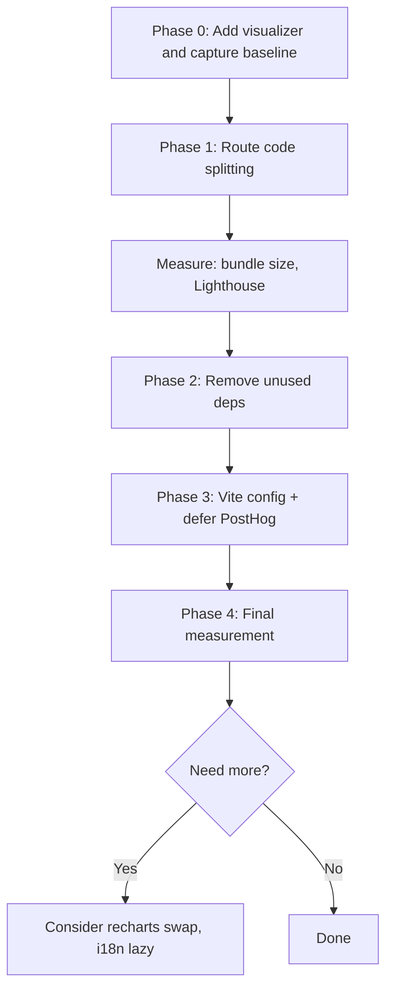

# App Performance Optimization Plan (v2 - Refined)

## Overview

Optimize application load time and dev experience using a **measure-first, iterate, verify** approach. Incorporate baseline measurement, bundle analysis, and phase-gated implementation with validation between steps.

---

## Phase 0: Baseline Measurement (Do This First)

**Goal:** Determine whether slowness is dev-only, production-only, or both.

### 0.1 Add Bundle Visualizer

```bash
npm install -D rollup-plugin-visualizer
```

Add to [vite.config.ts](vite.config.ts):

```ts
import { visualizer } from 'rollup-plugin-visualizer'

export default defineConfig({
  plugins: [
    react(),
    svgr(),
    // Only run visualizer when ANALYZE=true (don't slow normal builds)
    process.env.ANALYZE === 'true' && visualizer({ 
      filename: 'dist/stats.html', 
      open: true, 
      gzipSize: true 
    }),
  ].filter(Boolean),
  // ...
})
```

Run with: `ANALYZE=true npm run build`

### 0.2 Capture Baseline Metrics


| Metric                 | Command / Method                           | Record                 |
| ---------------------- | ------------------------------------------ | ---------------------- |
| **Production build**   | `npm run build`                            | Time to complete       |
| **Bundle sizes**       | Inspect `dist/assets/*.js`                 | List each chunk + size |
| **Bundle report**      | `npm run build` → open `dist/stats.html`   | Screenshot or notes    |
| **Production preview** | `npm run preview` → load in browser        | Initial load, TTI      |
| **Dev cold start**     | `rm -rf node_modules/.vite && npm run dev` | Time to "ready"        |
| **Lighthouse**         | Run on `npm run preview` (mobile)          | Performance score      |


### 0.3 Identify from Report

- What is in the main/initial chunk?
- What pulls in recharts (and where)?
- Any unexpectedly large modules?
- What loads on first paint vs. later?

**Output:** Baseline spreadsheet and bundle report. Use this to prioritize; if production is fast but dev is slow, focus on `optimizeDeps` and dev tooling rather than heavy refactoring.

---

## Phase 1: Route-Level Code Splitting (Highest Impact)

**Rationale:** Lazy-loading heavy pages (recharts, LandingPage, CSV) will reduce initial bundle significantly.

### 1.1 Pages to Lazy Load


| Route / Component   | Reason                                   |
| ------------------- | ---------------------------------------- |
| `LandingPage`       | 1355 lines, marketing-only               |
| `DashboardOverview` | recharts (AreaChart, BarChart, PieChart) |
| `AnalyticsPage`     | recharts                                 |
| `CSVImportPage`     | papaparse, wizard steps                  |
| `OrdersPage`        | Heavy page, PDF modal already lazy       |


### 1.2 Pages to Keep Eager

- Auth pages (Login, Signup, Onboarding, ClientSetup, AcceptInvite)
- Guards (AuthGuard, TenantProvider, etc.)
- DashboardLayout (shell)
- NotFound, PortalNotFound, TenantEntry, MainIndexRoute

### 1.3 Implementation

1. Create `src/components/PageLoader.tsx` — simple skeleton (e.g. `<Skeleton className="h-64 w-full" />` or spinner).
2. In [App.tsx](src/App.tsx):
  - Replace static imports with `React.lazy()` for the 5 pages above.
  - **Import from concrete files** (not index/barrels): e.g. `lazy(() => import('@/app/dashboard/overview'))`
  - Wrap each lazy route element in `<Suspense>` so dashboard shell doesn't disappear during route loads.
3. Ensure route `element` uses: `element={<Suspense fallback={<PageLoader />}><LazyComponent /></Suspense>}`.

### 1.4 Verify

- All routes still work.
- No hydration errors.
- `npm run build` — check that new chunks appear for LandingPage, Overview, Analytics, CSV, Orders.

### 1.5 Measure Again

- Bundle sizes (initial chunk should shrink).
- Lighthouse score.
- Time to interactive.

---

## Phase 2: Remove Unused Dependencies (Only After Verification)

**Rule:** Remove only if 100% unused across repo (src, scripts, supabase, config).

### 2.1 Verification (Done)


| Package       | Status                                                               |
| ------------- | -------------------------------------------------------------------- |
| **react-csv** | No imports in src. Supabase uses SQL table names only. **SAFE**      |
| **resend**    | `resendClient` uses `fetch()` to API. No `import 'resend'`. **SAFE** |
| **stripe**    | Server SDK. Client uses `@stripe/stripe-js`. No imports. **SAFE**    |
| **react-pdf** | PDF *viewer*. Only `@react-pdf/renderer` used. **SAFE**              |


### 2.2 Optional: Double-Check Before Removal

```bash
rg "from ['\"]react-csv|require\(['\"]react-csv" --type-add 'code:*.{ts,tsx,js,jsx}' -t code .
rg "from ['\"]resend['\"]|require\(['\"]resend" --type-add 'code:*.{ts,tsx,js,jsx}' -t code .
rg "from ['\"]stripe['\"]|require\(['\"]stripe" --type-add 'code:*.{ts,tsx,js,jsx}' -t code .
rg "from ['\"]react-pdf['\"]|require\(['\"]react-pdf['\"]" --type-add 'code:*.{ts,tsx,js,jsx}' -t code .
```

(Exclude `@react-pdf/renderer` and `@stripe/stripe-js` from the stripe/react-pdf searches.)

### 2.3 Removal

Remove from [package.json](package.json): `react-csv`, `resend`, `stripe`, `react-pdf`, `@types/react-csv`.

Run `npm install` and `npm run build` to confirm no breakage.

---

## Phase 3: Vite Config Refinements

### 3.1 lucide-react and optimizeDeps

Current: `optimizeDeps: { exclude: ['lucide-react'] }`.

- **Try removing the exclude** — let Vite pre-bundle lucide. If dev gets slower (e.g. many more requests), revert.
- If excluding helps dev, keep it; if it hurts cold start, remove.

### 3.2 manualChunks (Conservative)

Split only **heavy vendors** — avoid hardcoding every Radix package.

```ts
build: {
  rollupOptions: {
    output: {
      manualChunks: (id) => {
        if (id.includes('node_modules/recharts')) return 'vendor-recharts'
        if (id.includes('node_modules/posthog')) return 'vendor-posthog'
        if (id.includes('node_modules/@react-pdf')) return 'vendor-react-pdf'
      },
    },
  },
},
```

Or a minimal object form:

```ts
manualChunks: {
  'vendor-recharts': ['recharts'],
  'vendor-posthog': ['posthog-js'],
},
```

Avoid large, brittle manual chunk lists. Recharts and PostHog are the main heavy vendors worth isolating.

### 3.3 Defer PostHog (Analytics)

**Goal:** Do not block render or tenant resolution; still capture sessions.

In [main.tsx](src/main.tsx):

```ts
// Defer PostHog init until after first paint
if (typeof requestIdleCallback !== 'undefined') {
  requestIdleCallback(() => initAnalytics(), { timeout: 3000 })
} else {
  setTimeout(initAnalytics, 1000)
}
```

**Verification:** After defer, test that first pageview is still captured. If PostHog misses it, manually call `trackPageView()` after init or adjust timing.

Ensure `initAnalytics` remains a no-op if `VITE_POSTHOG_KEY` is missing/placeholder.

---

## Phase 4: Re-Measure and Iterate

After Phase 1–3:


| Metric               | Before | After  |
| -------------------- | ------ | ------ |
| Initial chunk (gzip) | ___ KB | ___ KB |
| Total bundle         | ___ KB | ___ KB |
| Lighthouse (mobile)  | ___    | ___    |
| Dev cold start       | ___ s  | ___ s  |
| TTI (approximate)    | ___ s  | ___ s  |


**Then:** Only proceed to deeper optimizations (e.g. recharts replacement, i18n lazy loading) if metrics show clear room for improvement.

---

## Implementation Order




---

## Files to Modify


| Phase | File                          | Changes                                                       |
| ----- | ----------------------------- | ------------------------------------------------------------- |
| 0     | vite.config.ts                | Add rollup-plugin-visualizer                                  |
| 1     | src/App.tsx                   | React.lazy for 5 routes, Suspense + PageLoader                |
| 1     | src/components/PageLoader.tsx | New skeleton component                                        |
| 2     | package.json                  | Remove react-csv, resend, stripe, react-pdf, @types/react-csv |
| 3     | vite.config.ts                | optionalChunks / manualChunks, optimizeDeps tweak             |
| 3     | src/main.tsx                  | Defer initAnalytics (requestIdleCallback)                     |


---

## Success Criteria

- Smaller initial bundle
- Faster first paint
- Better route load performance
- Maintainable Vite config
- Measurable improvements at each phase

