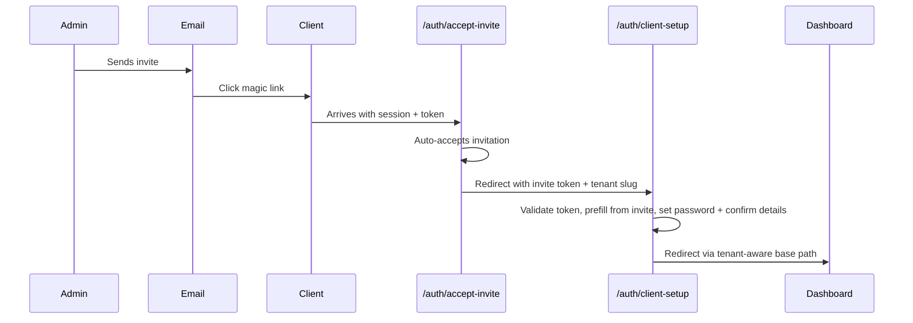

# Complete the Invite Acceptance Flow

## Problem

When an invited client clicks the Supabase email link, they get authenticated via magic link but have **no password** set. The current accept-invite page then sends them to the login page, which requires a password they don't have. We need to close this gap with a password-setup step and a lightweight onboarding confirmation.

## Flow After Fix

## Changes

### 1. New page: `/auth/client-setup` (lightweight onboarding for invited clients)

Create `[src/app/auth/client-setup.tsx](src/app/auth/client-setup.tsx)` -- a single-step form with:

- **Set password** (required, min 6 chars, confirm field)
- **Company name** (prefilled from invitation data on the profile, editable)
- **Phone** (optional)
- **Address** (optional)
- Submit calls `supabase.auth.updateUser({ password })` + updates the profile row
- On success, redirect using the existing `useTenantPath().withBase('/dashboard')` from `[src/lib/tenant/TenantProvider.tsx](src/lib/tenant/TenantProvider.tsx)` -- this automatically resolves to the correct tenant domain path or `/t/:slug/dashboard` depending on how the tenant was accessed. No hardcoded paths.

**Invite validation**: The page reads `?invite=INVITATION_ID&tenant=SLUG` from the URL. On mount it:

1. Requires an active session (redirect to login if none)
2. Loads the invitation record by ID via `get_invitation_by_token` RPC or a direct query to confirm it's a valid accepted invite for the current user's email
3. Prefills company name from `invitation.company_name` (falls back to profile `company_name`)
4. If no valid invitation is found, shows an error -- this is not a generic setup page

This page is **only for invited clients** -- it does NOT touch the admin onboarding flow in `[src/app/auth/onboarding.tsx](src/app/auth/onboarding.tsx)`.

### 2. Update accept-invite page: redirect to `/auth/client-setup` instead of dashboard

In `[src/app/auth/accept-invite.tsx](src/app/auth/accept-invite.tsx)`, change the success state:

- After successful acceptance, **auto-redirect** to `/auth/client-setup?invite=INVITATION_ID&tenant=SLUG`
- Pass the invitation ID (not token -- the token is sensitive) so the setup page can securely load and prefill data
- The accept-invite edge function already returns `tenant_slug` -- also return `invitation_id` from the response
- This ensures every newly accepted client passes through password setup before reaching the dashboard

### 3. Add route in App.tsx

In `[src/App.tsx](src/App.tsx)`, add:

- `<Route path="/auth/client-setup" element={<ClientSetupPage />} />` (top-level, same level as accept-invite)
- Also add it under the `/t/:slug` routes for slug-based access

### 4. Add i18n keys

In `[src/locales/en.json](src/locales/en.json)`, add keys under a new `clientSetup` section:

- `title`, `subtitle`, `passwordLabel`, `confirmPasswordLabel`, `passwordMismatch`, `companyNameLabel`, `phoneLabel`, `addressLabel`, `submitButton`, `successTitle`, `successDesc`

### 5. Minimal edge function tweak

In `[supabase/functions/accept-invite/index.ts](supabase/functions/accept-invite/index.ts)`, add `invitation_id: invitation.id` to the success response so the accept-invite page can pass it to client-setup.

### 6. No other files change

- No changes to `[src/app/auth/login.tsx](src/app/auth/login.tsx)`
- No changes to `[src/app/auth/onboarding.tsx](src/app/auth/onboarding.tsx)`
- No changes to tenant login flows or platform login logic
- No changes to `[supabase/functions/invite-client/index.ts](supabase/functions/invite-client/index.ts)`

