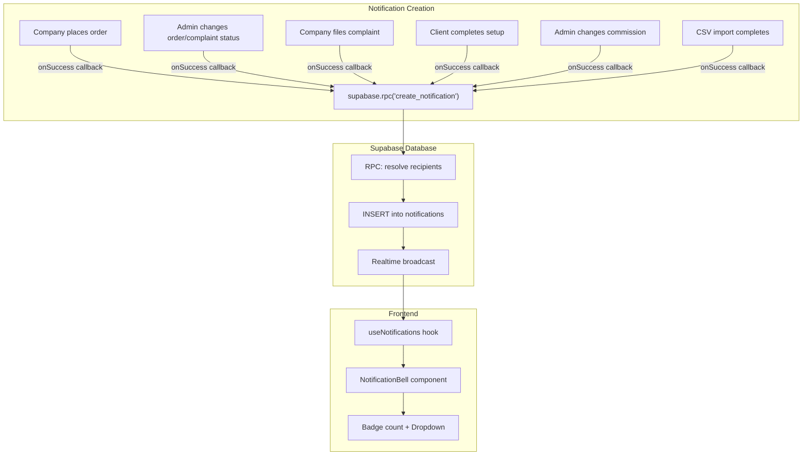

# Notifications System v1

## Key Design Decisions

1. **Per-user rows instead of audience-based**: Each notification is a **row per recipient user**. This makes querying trivial (`WHERE user_id = auth.uid()`), gives built-in per-user `read_at` tracking, and avoids a separate `notification_reads` junction table. The fan-out (determining recipients) happens at creation time via a Supabase RPC function.
2. **Supabase RPC for creation (not client-side fan-out)**: A single `create_notification` database function handles recipient resolution and batch insert. Atomic, reliable, and keeps business logic in one place.
3. **Tenant derived server-side, not from client**: The RPC uses `current_tenant_id()` (already exists in `tenant-data-isolation.sql`) to derive tenant from the authenticated user's membership. Client never passes tenant_id -- prevents cross-tenant spoofing.
4. **Strict RLS -- no direct INSERT**: The table has NO INSERT policy. Only the SECURITY DEFINER RPC can insert rows. SELECT and UPDATE (read_at only) are restricted to `user_id = auth.uid()`.
5. **metadata JSONB instead of title/body text**: Since the app is bilingual (en/bg via i18n), notification text is NOT stored in the DB. Instead, `type` serves as the i18n key and `metadata JSONB` stores structured data (company name, order number, status, etc.). The frontend constructs the display string: `t('notifications.order_created', metadata)`. This ensures proper localization.
6. **FK constraints on user_id and actor_id**: Both reference `auth.users(id)` -- consistent with existing practice in profiles, tenant_memberships, and tenant_invitations tables.
7. **Realtime filtered by user_id**: Supabase `postgres_changes` subscription filtered to `user_id=eq.{currentUserId}`. Tenant isolation is guaranteed by the per-user design (each row was fan-out to a specific user within a tenant).
8. **7 event types** covering orders, complaints, client lifecycle, pricing, and catalog -- identified after auditing all 30+ mutations in the app.

---

## Architecture




---

## 1. Database Table and RPC

**New file:** `supabase/create-notifications-table.sql`

```sql
CREATE TABLE notifications (
  id          UUID DEFAULT gen_random_uuid() PRIMARY KEY,
  tenant_id   UUID NOT NULL REFERENCES tenants(id) ON DELETE CASCADE,
  user_id     UUID NOT NULL REFERENCES auth.users(id) ON DELETE CASCADE,
  actor_id    UUID REFERENCES auth.users(id) ON DELETE SET NULL,
  type        TEXT NOT NULL,
  entity_type TEXT,
  entity_id   TEXT,
  metadata    JSONB NOT NULL DEFAULT '{}',
  read_at     TIMESTAMPTZ,
  created_at  TIMESTAMPTZ DEFAULT now()
);

CREATE INDEX idx_notifications_user_tenant 
  ON notifications(user_id, tenant_id, created_at DESC);
CREATE INDEX idx_notifications_unread 
  ON notifications(user_id, tenant_id) WHERE read_at IS NULL;
```

**RLS policies (strict):**

- `SELECT`: `user_id = auth.uid()` -- users see only their own notifications
- `UPDATE`: `user_id = auth.uid()` -- users can only mark their own as read
- **No INSERT policy** -- only the SECURITY DEFINER RPC can insert rows. This prevents clients from injecting fake notifications.

**RPC function** `create_notification(...)` (SECURITY DEFINER):

- Accepts: `p_type`, `p_entity_type`, `p_entity_id`, `p_metadata`, `p_target_audience` ('admins' | 'company' | 'all_companies'), `p_target_company_id`
- **Derives tenant_id internally** via `current_tenant_id()` and `auth.uid()` for actor_id -- never trusts client-supplied tenant
- If `target_audience = 'admins'`: queries `profiles` for all `role = 'admin'` users in the tenant
- If `target_audience = 'company'`: queries `profiles` for all users with `company_id = p_target_company_id` in the tenant
- If `target_audience = 'all_companies'`: queries `profiles` for all `role = 'company'` users in the tenant (used for `catalog_updated`)
- Batch inserts one row per recipient (excluding the actor themselves)
- Validates caller is a member of the derived tenant before inserting

**Notification types for v1 (7 types):**

**Orders & Complaints (core):**

- `order_created` -- company places an order -> notify all tenant admins
- `order_status_changed` -- admin updates order status (shipped, completed, rejected) -> notify the company user(s)
- `complaint_created` -- company files a complaint -> notify all tenant admins
- `complaint_status_changed` -- admin updates complaint status -> notify the company user who filed it

**Client lifecycle:**

- `client_registered` -- invited client completes setup (password set, invitation_status -> 'active') -> notify all tenant admins. High value: admin wants to know "Client X just joined!"

**Pricing:**

- `commission_changed` -- admin changes a client's commission rate -> notify the affected company user. This directly changes every product price they see, so they need to know.

**Catalog:**

- `catalog_updated` -- CSV import completes successfully -> notify all company users in the tenant. B2B retailers want to know when new products or updated prices are available.

---

## 2. TypeScript Types

**Modify:** [src/types/index.ts](src/types/index.ts)

```typescript
export type NotificationType = 
  | 'order_created' 
  | 'order_status_changed' 
  | 'complaint_created' 
  | 'complaint_status_changed'
  | 'client_registered'
  | 'commission_changed'
  | 'catalog_updated'

// Structured metadata stored per notification type (used for i18n interpolation)
// e.g. { company_name: "Acme", order_number: 1042, status: "shipped" }
export interface NotificationMetadata {
  company_name?: string
  order_number?: number
  status?: string
  commission_rate?: number
  imported_count?: number
  updated_count?: number
  [key: string]: unknown
}

export interface AppNotification {
  id: string
  tenant_id: string
  user_id: string
  actor_id?: string
  type: NotificationType
  entity_type?: string
  entity_id?: string
  metadata: NotificationMetadata
  read_at?: string | null
  created_at: string
}
```

Note: Named `AppNotification` to avoid collision with the browser's built-in `Notification` API.

---

## 3. `useNotifications` Hook

**New file:** `src/hooks/useNotifications.ts`

Responsibilities:

- **Fetch**: TanStack Query to fetch last 20 notifications + unread count
- **Realtime**: Supabase `postgres_changes` subscription on `notifications` table filtered by `user_id`, invalidates query on INSERT
- **Mark read**: mutation to `UPDATE notifications SET read_at = now() WHERE id = ?`
- **Mark all read**: mutation to `UPDATE notifications SET read_at = now() WHERE user_id = ? AND tenant_id = ? AND read_at IS NULL`

Uses existing patterns: `const { tenant } = useTenant()` for `tenantId`, `useAuth()` for `user.id`.

---

## 4. `NotificationBell` Component

**New file:** `src/components/NotificationBell.tsx`

- Bell icon (lucide-react `Bell`) matching the existing cart icon style (ghost button, 9x9)
- Red badge with unread count (same style as cart badge, using shadcn `Badge` variant="destructive")
- shadcn `Popover` dropdown (not DropdownMenu -- better for rich content)
- Dropdown contents:
  - Header: "Notifications" + "Mark all as read" button
  - Scrollable list (max-h, ~320px) of notification items
  - Each item: icon by type, localized message from `t('notifications.{type}', metadata)`, relative time (e.g., "2 min ago"), unread dot indicator
  - Click on item: marks as read + navigates to the relevant entity page
  - Empty state: "No notifications yet"
- Dark mode support (matching existing theme patterns)

---

## 5. Dashboard Layout Integration

**Modify:** [src/app/dashboard/layout.tsx](src/app/dashboard/layout.tsx)

- Import `NotificationBell` component
- Add it in the topbar's right actions group, between the theme toggle and the cart icon (line ~197 area), with a vertical divider on each side
- No additional imports needed beyond the component itself

---

## 6. Notification Creation Integration

**Modify existing files** to call `supabase.rpc('create_notification', {...})` in `onSuccess` callbacks:

**Orders & Complaints (4 events):**

- **Order created** (company side): In [src/components/QuoteRequestModal.tsx](src/components/QuoteRequestModal.tsx) -- after successful quote insert, fire notification targeting admins
- **Order status changed** (admin side): In [src/app/dashboard/orders/AdminOrdersView.tsx](src/app/dashboard/orders/AdminOrdersView.tsx) -- after status update mutation succeeds, fire notification targeting the company user(s)
- **Complaint created** (company side): In [src/app/dashboard/complaints/NewComplaintTab.tsx](src/app/dashboard/complaints/NewComplaintTab.tsx) -- after successful complaint insert
- **Complaint status changed** (admin side): In [src/app/dashboard/complaints/AdminComplaintsView.tsx](src/app/dashboard/complaints/AdminComplaintsView.tsx) -- after status update mutation succeeds

**Client lifecycle (1 event):**

- **Client registered**: In [src/app/auth/client-setup.tsx](src/app/auth/client-setup.tsx) -- after client completes setup (sets password, invitation_status -> 'active'), fire notification targeting all tenant admins: "Client [Company Name] just joined"

**Pricing (1 event):**

- **Commission changed**: In [src/hooks/useMutationClient.ts](src/hooks/useMutationClient.ts) -- after admin updates `commission_rate`, fire notification targeting the affected company user: "Your commission rate was updated to X%"

**Catalog (1 event):**

- **Catalog updated**: In [src/components/csv-import/CSVImportWizard.tsx](src/components/csv-import/CSVImportWizard.tsx) -- after successful CSV import completes, fire notification targeting all company users in the tenant. Only fires if `imported > 0 || updated > 0` (skip if no meaningful changes).

A small helper `sendNotification()` utility in `src/lib/notifications.ts` will wrap the `supabase.rpc` call to keep mutation callbacks clean.

---

## 7. Internationalization

**Modify:** `src/locales/en.json` and `src/locales/bg.json`

Add keys under a `notifications` namespace:

- UI keys: `notifications.title`, `notifications.markAllRead`, `notifications.empty`, `notifications.noNotifications`
- Per-type keys with interpolation placeholders (these are rendered using `metadata`):
  - `notifications.order_created`: "New order #{{order_number}} from {{company_name}}"
  - `notifications.order_status_changed`: "Order #{{order_number}} status changed to {{status}}"
  - `notifications.complaint_created`: "New complaint from {{company_name}}"
  - `notifications.complaint_status_changed`: "Complaint status updated to {{status}}"
  - `notifications.client_registered`: "{{company_name}} just joined the platform"
  - `notifications.commission_changed`: "Your commission rate was updated to {{commission_rate}}%"
  - `notifications.catalog_updated`: "Product catalog updated -- {{imported_count}} new, {{updated_count}} updated"
- Same keys in Bulgarian in `bg.json`
- Time-relative labels (use `date-fns` `formatDistanceToNow` which is already a dependency via TanStack Query's devtools)

---

## Files Summary

**New files (4):**

- `supabase/create-notifications-table.sql` -- table, indexes, RLS, RPC function
- `src/hooks/useNotifications.ts` -- fetch, realtime, mark-read mutations
- `src/components/NotificationBell.tsx` -- bell icon, badge, popover dropdown
- `src/lib/notifications.ts` -- helper utility wrapping supabase.rpc

**Modified files (10):**

- `src/types/index.ts` -- add Notification and NotificationType
- `src/app/dashboard/layout.tsx` -- add bell to topbar
- `src/components/QuoteRequestModal.tsx` -- order_created notification
- `src/app/dashboard/orders/AdminOrdersView.tsx` -- order_status_changed notification
- `src/app/dashboard/complaints/NewComplaintTab.tsx` -- complaint_created notification
- `src/app/dashboard/complaints/AdminComplaintsView.tsx` -- complaint_status_changed notification
- `src/app/auth/client-setup.tsx` -- client_registered notification
- `src/hooks/useMutationClient.ts` -- commission_changed notification
- `src/components/csv-import/CSVImportWizard.tsx` -- catalog_updated notification
- `src/locales/en.json` + `src/locales/bg.json` -- notification strings

